# Contributing to Toolbox

Thank you for helping make Toolbox safer and more useful.

```mermaid
%%{init: {"theme":"base","flowchart":{"curve":"basis"},"themeVariables":{"background":"#F7F7F5","fontFamily":"Inter, Arial, sans-serif","lineColor":"#667085","primaryTextColor":"#172B4D"}}}%%
flowchart LR
    I["Issue or idea"]:::yellow --> D["Small focused change"]:::blue
    D --> V["Format + tests + build"]:::pink
    V --> R["Pull request"]:::purple
    R --> M["Review and merge"]:::green
    classDef yellow fill:#FFF4A3,stroke:#C9A227,stroke-width:2px,color:#172B4D
    classDef blue fill:#D9EAFD,stroke:#4C78A8,stroke-width:2px,color:#172B4D
    classDef pink fill:#FFE1E6,stroke:#C96A7B,stroke-width:2px,color:#172B4D
    classDef purple fill:#E9DDF7,stroke:#8064A2,stroke-width:2px,color:#172B4D
    classDef green fill:#DDF5E3,stroke:#4F9D69,stroke-width:2px,color:#172B4D
```



## English

### Principles

- Keep Diskora and Changeora independent, focused, and local-first.
- Make filesystem mutations explicit, previewable, and recoverable whenever macOS permits.
- Never broaden a deletion target through unchecked globs, unresolved variables, or name-only matching.
- Prefer Apple or vendor-supported APIs and commands over deleting internal data directories.
- Do not add telemetry, analytics, or network transfer without an explicit design and privacy review.

### Development workflow

1. Open an issue for substantial behavior, security, or user-interface changes.
2. Create a focused branch and keep unrelated edits out of the change.
3. Add or update tests before requesting review.
4. Run the checks below in each modified application.
5. Update all affected documentation in English first, Vietnamese second, and Japanese third.
6. Open a pull request describing behavior, safety impact, testing, and screenshots when the UI changes.

### Required checks

```bash
cd apps/diskora
swift format lint --recursive --parallel Sources Tests Package.swift
swift test
./scripts/test_core.sh
swift build

cd ../changeora
swift format lint --recursive --parallel Sources Tests Package.swift
swift test
./scripts/test_core.sh
swift build
```

Release-affecting changes must also pass `swift build -c release` and each app's `scripts/build_release.sh`.

### Pull-request checklist

- The change has a clear user outcome and limited scope.
- Risky operations show the exact target and require confirmation.
- New filesystem behavior has unit or smoke coverage.
- Errors are actionable and do not expose unrelated personal paths.
- Accessibility labels and keyboard behavior remain usable.
- Documentation and changelog entries are complete in all three languages.
- New user-facing copy is added to the English localization resource and verified in both in-app languages; do not hard-code English-only UI.

### Commit guidance

Use short, imperative subjects such as `feat(diskora): add conflict-safe restore` or `fix(changeora): retain deep FSEvents`. Do not commit build output, local history, credentials, signing identities, or personal reports.

## Tiếng Việt

### Nguyên tắc

- Giữ Diskora và Changeora độc lập, tập trung và local-first.
- Mọi thay đổi filesystem phải rõ ràng, xem trước được và có thể phục hồi khi macOS cho phép.
- Không mở rộng phạm vi xóa bằng glob chưa kiểm tra, biến chưa resolve hoặc đối sánh chỉ dựa trên tên.
- Ưu tiên API và lệnh chính thức của Apple hoặc nhà cung cấp thay vì xóa trực tiếp thư mục dữ liệu nội bộ.
- Không thêm telemetry, analytics hoặc truyền dữ liệu mạng nếu chưa có thiết kế và đánh giá quyền riêng tư rõ ràng.

### Quy trình phát triển

1. Mở issue cho thay đổi lớn về hành vi, bảo mật hoặc giao diện.
2. Tạo branch tập trung và không trộn thay đổi không liên quan.
3. Thêm hoặc cập nhật test trước khi yêu cầu review.
4. Chạy các kiểm tra bắt buộc trong từng ứng dụng được sửa.
5. Cập nhật tài liệu theo thứ tự tiếng Anh, tiếng Việt, tiếng Nhật.
6. Mở pull request mô tả kết quả người dùng, ảnh hưởng an toàn, kiểm thử và screenshot nếu có đổi UI.

### Kiểm tra bắt buộc

Dùng đúng các lệnh trong phần English. Thay đổi ảnh hưởng release phải chạy thêm `swift build -c release` và `scripts/build_release.sh` của từng app.

### Checklist pull request

- Thay đổi có kết quả người dùng rõ ràng và phạm vi giới hạn.
- Thao tác rủi ro hiển thị đúng target và yêu cầu xác nhận.
- Hành vi filesystem mới có unit test hoặc smoke test.
- Lỗi có hướng xử lý và không lộ đường dẫn cá nhân không liên quan.
- Accessibility label và điều khiển bàn phím vẫn hoạt động.
- Tài liệu và changelog đầy đủ ở cả ba ngôn ngữ.
- Nội dung mới trên giao diện phải có trong tài nguyên localization tiếng Anh và được kiểm tra ở cả hai ngôn ngữ trong app; không hard-code UI chỉ có English.

### Commit

Dùng tiêu đề ngắn ở thể mệnh lệnh, ví dụ `feat(diskora): add conflict-safe restore`. Không commit build output, lịch sử local, credential, signing identity hoặc báo cáo cá nhân.

## 日本語

### 原則

- Diskora と Changeora を独立した focused/local-first アプリとして維持します。
- Filesystem の変更は明示し、preview 可能かつ macOS が許す限り復元可能にします。
- 未検証 glob、未解決変数、名前だけの一致で削除範囲を広げません。
- 内部データ directory の直接削除より、Apple または vendor が提供する API/command を優先します。
- 明確な設計と privacy review なしに telemetry、analytics、network transfer を追加しません。

### 開発フロー

1. 大きな動作、security、UI 変更は issue を作成します。
2. 変更範囲を限定した branch を作り、無関係な編集を混ぜません。
3. Review 前に test を追加または更新します。
4. 変更した各アプリで必須 check を実行します。
5. ドキュメントを英語、ベトナム語、日本語の順に更新します。
6. User outcome、安全性への影響、test、UI 変更時の screenshot を記載した pull request を作成します。

### 必須チェック

English セクションのコマンドをそのまま実行してください。Release に影響する変更では `swift build -c release` と各アプリの `scripts/build_release.sh` も必要です。

### Pull request checklist

- User outcome と scope が明確です。
- Risk のある操作は正確な target を表示し、確認を要求します。
- 新しい filesystem 動作に unit または smoke test があります。
- Error は対処可能で、無関係な個人 path を公開しません。
- Accessibility label と keyboard 操作を維持しています。
- Documentation と changelog が 3 言語で完成しています。
- 新しい user-facing copy を English localization resource に追加し、アプリ内の両言語で確認します。English-only UI を hard-code しません。

### Commit

`feat(diskora): add conflict-safe restore` のような短い命令形 subject を使います。Build output、local history、credential、signing identity、個人 report は commit しません。
