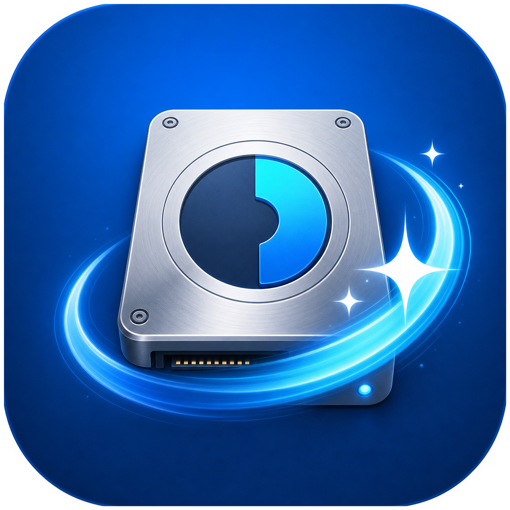
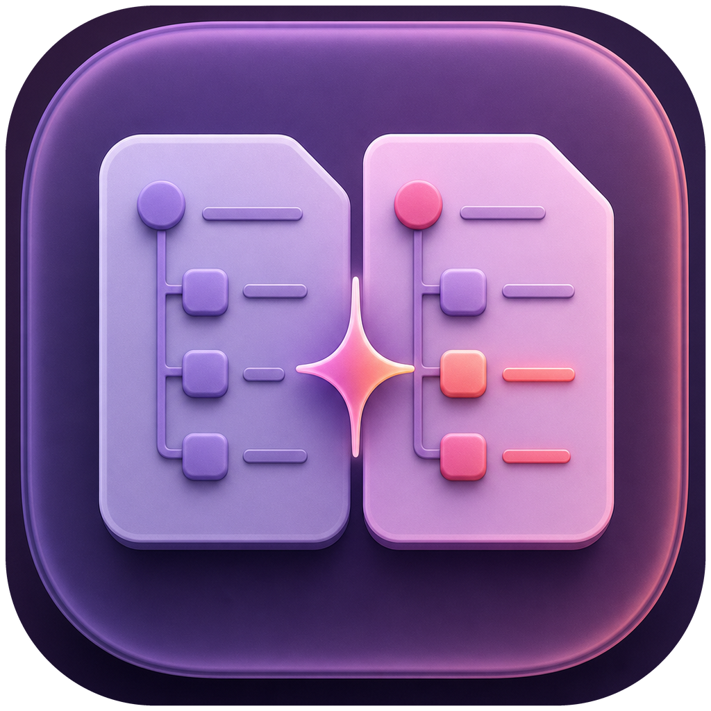

# Thang Toolbox

[Tiếng Việt](#vi) · [English](#en) · [日本語](#ja)

  
  

## Tiếng Việt

Monorepo dành cho các ứng dụng và tiện ích nhỏ, tập trung vào tính hữu ích, minh bạch, xử lý cục bộ và an toàn.

### Ứng dụng

| App | Mô tả | Phiên bản | Nền tảng |
| --- | --- | --- | --- |
| [Diskora](apps/diskora) | Phân tích và quản lý dung lượng — *See where your space goes.* | 1.0.0 | macOS 13+ |
| [Changeora](apps/changeora) | Theo dõi thay đổi sau khi cài app — *See what changed on your Mac.* | 1.0.0 | macOS 13+ |

### Cài đặt và phát hành

Mỗi ứng dụng có hướng dẫn build và cài đặt riêng. Release miễn phí bao gồm mã nguồn tại Git tag tương ứng, ZIP được ký ad-hoc và checksum SHA-256.

Các binary hiện chưa có Developer ID và chưa được Apple notarize. Người dùng có thể cần chọn **System Settings → Privacy & Security → Open Anyway**, hoặc tự build từ source.

### Nguyên tắc

- Không telemetry hoặc gửi dữ liệu ra ngoài nếu chưa có sự đồng ý rõ ràng.
- Mọi thao tác xóa phải có xem trước và xác nhận.
- Ưu tiên Trash để dữ liệu có thể được khôi phục.
- Công khai mã nguồn, giới hạn kỹ thuật và quy trình build.
- Không mô tả kết quả kỹ thuật như một kết luận malware khi chưa đủ bằng chứng.
- Báo cáo lỗ hổng theo [SECURITY.md](SECURITY.md), không đăng dữ liệu nhạy cảm lên issue công khai.

### Tài liệu

- [Kiến trúc](docs/ARCHITECTURE.md)
- [Quy trình phát hành](docs/RELEASING.md)
- [Đóng góp](CONTRIBUTING.md)
- [Quyền riêng tư](PRIVACY.md)
- [Bảo mật](SECURITY.md)

Mã nguồn được phát hành theo [MIT License](LICENSE), trừ khi một thư mục ứng dụng ghi rõ điều khác.

---

## English

A monorepo for small applications and utilities focused on usefulness, transparency, local processing, and safety.

### Applications

| App | Description | Version | Platform |
| --- | --- | --- | --- |
| [Diskora](apps/diskora) | Storage analysis and management — *See where your space goes.* | 1.0.0 | macOS 13+ |
| [Changeora](apps/changeora) | Track changes made after app installation — *See what changed on your Mac.* | 1.0.0 | macOS 13+ |

### Installation and releases

Each application provides its own build and installation instructions. Free releases include source code at the corresponding Git tag, an ad-hoc signed ZIP, and a SHA-256 checksum.

The binaries currently have no Developer ID signature and are not notarized by Apple. Users may need to choose **System Settings → Privacy & Security → Open Anyway**, or build from source.

### Principles

- No telemetry or outbound data transfer without clear consent.
- Every destructive action must provide a preview and confirmation.
- Prefer Trash so data remains recoverable.
- Publish the source code, technical limitations, and build process.
- Do not present technical observations as malware verdicts without sufficient evidence.
- Report vulnerabilities through [SECURITY.md](SECURITY.md); never post sensitive data in public issues.

### Documentation

- [Architecture](docs/ARCHITECTURE.md)
- [Release process](docs/RELEASING.md)
- [Contributing](CONTRIBUTING.md)
- [Privacy](PRIVACY.md)
- [Security](SECURITY.md)

Source code is released under the [MIT License](LICENSE), unless an application directory states otherwise.

---

## 日本語

実用性、透明性、ローカル処理、安全性を重視した小規模アプリケーションおよびユーティリティ用のモノレポです。

### アプリケーション

| アプリ | 説明 | バージョン | プラットフォーム |
| --- | --- | --- | --- |
| [Diskora](apps/diskora) | ストレージの分析と管理 — *See where your space goes.* | 1.0.0 | macOS 13+ |
| [Changeora](apps/changeora) | アプリのインストール後に発生した変更を追跡 — *See what changed on your Mac.* | 1.0.0 | macOS 13+ |

### インストールとリリース

各アプリケーションには個別のビルド手順とインストール手順があります。無料リリースには、対応する Git タグのソースコード、ad-hoc 署名済み ZIP、SHA-256 チェックサムが含まれます。

現在のバイナリには Developer ID 署名がなく、Apple の notarization も行われていません。必要に応じて **システム設定 → プライバシーとセキュリティ → このまま開く** を選択するか、ソースからビルドしてください。

### 原則

- 明確な同意なしに telemetry や外部へのデータ送信を行いません。
- 破壊的な操作には必ずプレビューと確認を用意します。
- データを復元できるよう、可能な限りゴミ箱を使用します。
- ソースコード、技術的制限、ビルド手順を公開します。
- 十分な証拠がない技術的観測をマルウェア判定として扱いません。
- 脆弱性は [SECURITY.md](SECURITY.md) に従って報告し、公開 Issue に機密情報を投稿しないでください。

### ドキュメント

- [アーキテクチャ](docs/ARCHITECTURE.md)
- [リリース手順](docs/RELEASING.md)
- [コントリビューション](CONTRIBUTING.md)
- [プライバシー](PRIVACY.md)
- [セキュリティ](SECURITY.md)

各アプリケーションのディレクトリに別途記載がない限り、ソースコードは [MIT License](LICENSE) の下で公開されます。
