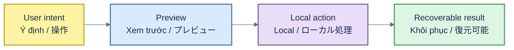

# Toolbox

[English](#english) · [Tiếng Việt](#tiếng-việt) · [日本語](#日本語)

A monorepo of small, transparent, local-first macOS utilities.


```mermaid
%%{init: {"theme":"base","themeVariables":{"background":"#FFFFFF","fontFamily":"Arial, sans-serif","lineColor":"#667085","primaryTextColor":"#172B4D"}}}%%
flowchart LR
    U["User intent<br/>Ý định / 操作"]:::yellow
    P["Preview<br/>Xem trước / プレビュー"]:::blue
    A["Local action<br/>Local / ローカル処理"]:::purple
    R["Recoverable result<br/>Khôi phục / 復元可能"]:::green
    U --> P --> A --> R
    classDef yellow fill:#FFF4A3,stroke:#C9A227,stroke-width:2px,color:#172B4D
    classDef blue fill:#D9EAFD,stroke:#4C78A8,stroke-width:2px,color:#172B4D
    classDef purple fill:#E9DDF7,stroke:#8064A2,stroke-width:2px,color:#172B4D
    classDef green fill:#DDF5E3,stroke:#4F9D69,stroke-width:2px,color:#172B4D
```

## English

Current applications:

- **Diskora** — analyzes macOS storage and provides reviewed, recoverable cleanup.
- **Changeora** — records filesystem changes associated with application installation.

Both applications require macOS 13+ and can be built from their directories:

```bash
cd apps/diskora && swift test && swift build
cd apps/changeora && swift test && swift build
```

No telemetry or outbound transfer occurs without clear consent. Destructive actions require a preview and confirmation, and recoverable Trash operations are preferred.

## Tiếng Việt

Ứng dụng hiện có:

- **Diskora** — phân tích dung lượng macOS và chỉ dọn dẹp sau khi người dùng xem trước.
- **Changeora** — ghi nhận thay đổi filesystem liên quan tới quá trình cài ứng dụng.

Cả hai yêu cầu macOS 13+. Dùng các lệnh ở phần English để test và build. Không có telemetry hoặc truyền dữ liệu ra ngoài nếu chưa có sự đồng ý rõ ràng; thao tác phá hủy phải được xem trước và xác nhận.

## 日本語

現在のアプリ:

- **Diskora** — macOS のストレージを分析し、確認後に復元可能なクリーンアップを行います。
- **Changeora** — アプリのインストールに関連するファイルシステム変更を記録します。

いずれも macOS 13 以上が必要です。テストとビルドには English セクションのコマンドを使用してください。明確な同意なしにテレメトリや外部送信を行わず、破壊的操作にはプレビューと確認を必須とします。

Released under the [MIT License](LICENSE).
