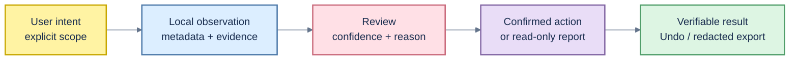

# Toolbox for macOS

[English](#english) · [Tiếng Việt](#tiếng-việt) · [日本語](#日本語)

Toolbox is a local-first macOS utility for understanding changes and reclaiming space safely. Toolbox 2.0 is currently pre-release; the stable Diskora and Changeora apps remain available while their proven workflows move into one GUI.


```mermaid
%%{init: {"theme":"base","themeVariables":{"background":"#F7F7F5","fontFamily":"Inter, Arial, sans-serif","lineColor":"#64748B","primaryTextColor":"#172B4D"},"flowchart":{"curve":"basis","nodeSpacing":42,"rankSpacing":55}}}%%
flowchart LR
    I["User intent<br/>explicit scope"]:::stickyYellow
    O["Local observation<br/>metadata + evidence"]:::stickyBlue
    R["Review<br/>confidence + reason"]:::stickyPink
    A["Confirmed action<br/>or read-only report"]:::stickyPurple
    V["Verifiable result<br/>Undo / redacted export"]:::stickyGreen
    I --> O --> R --> A --> V
    classDef stickyYellow fill:#FFF3A3,stroke:#C7A600,stroke-width:2px,color:#172B4D
    classDef stickyBlue fill:#DCEEFF,stroke:#4C78A8,stroke-width:2px,color:#172B4D
    classDef stickyPink fill:#FFE0E6,stroke:#C96A7B,stroke-width:2px,color:#172B4D
    classDef stickyPurple fill:#E9DDF7,stroke:#8064A2,stroke-width:2px,color:#172B4D
    classDef stickyGreen fill:#DDF5E3,stroke:#4F9D69,stroke-width:2px,color:#172B4D
```

## English

### Applications

| Application | Version | Purpose | Safety boundary |
| --- | --- | --- | --- |
| **Toolbox** | 2.0.0 pre-release | One GUI for Storage, Projects, Applications, Change Timeline, and Recovery | Local-only; no automatic deletion; every mutation remains reviewable and recoverable where macOS permits |
| **Diskora** | 1.3.0 | Analyze storage, review cleanup candidates, find duplicates and similar photos, manage developer data, and inspect application artifacts | Every mutation requires confirmation; recoverable operations go to Trash and are recorded by Undo Center |
| **Changeora** | 1.4.0 | Record installation, update, and uninstall activity using snapshots plus FSEvents | Read-only: it never deletes, disables, or modifies observed system components |

Toolbox 2.0 currently provides the unified six-destination shell and ports the stable Diskora and Changeora engines without changing their safety boundaries. Shared evidence, migration, and signed distribution remain pre-release work.

Diskora 1.2 adds Undo Center, cleanup-confidence explanations, a partial-hash duplicate pipeline, pairwise photo clustering, evidence-based application artifacts, allowlisted developer cleanup commands, and scheduled scan-only notifications.

Changeora 1.3 adds real-time FSEvents journaling, broader persistence and configuration coverage, explainable risk scoring, application attribution, trusted baselines, arbitrary session comparison, and redacted Markdown/JSON exports.

Both applications now provide an in-app English/Vietnamese language selector. English is the default, the selection is persisted locally, and changing it refreshes the interface without reinstalling or changing the macOS system language.

### Requirements

- macOS 13 or later.
- Swift tools 6.0 or later.
- Full Xcode is recommended for XCTest, universal builds, signing, and notarization.
- Some protected locations require Full Disk Access for complete observation.

### Build and verify

Run the unified pre-release gate:

```bash
cd apps/toolbox
swift format lint --recursive --parallel Sources Tests Package.swift
swift test
./scripts/test_core.sh
./scripts/test_storage.sh
./scripts/test_changes.sh
swift build -c release
./scripts/build_app.sh
```

The legacy packages retain their independent validation:

```bash
swift format lint --recursive --parallel Sources Tests Package.swift
swift test
./scripts/test_core.sh
swift build
swift build -c release
```

Build the local Toolbox bundle:

```bash
cd apps/toolbox && ./scripts/build_app.sh
```

Build legacy application bundles:

```bash
cd apps/diskora && ./scripts/build_release.sh
cd apps/changeora && ./scripts/build_release.sh
```

### Repository layout

```text
toolbox/
├── apps/
│   ├── diskora/       # Independent Swift package and macOS app
│   ├── changeora/     # Independent Swift package and macOS app
│   └── toolbox/       # Unified Toolbox 2.0 pre-release package
├── docs/
│   ├── ARCHITECTURE.md
│   └── OPERATIONS.md
├── .github/workflows/ci.yml
├── SECURITY.md
├── PRIVACY.md
└── CONTRIBUTING.md
```

### Trust principles

- Local processing by default; no telemetry or outbound transfer.
- Preview and explicit confirmation before mutations.
- Trash-backed operations record original and resulting paths for conflict-safe restoration.
- Changeora reports evidence and uncertainty rather than declaring software malicious.
- Support exports redact the current user's home-directory prefix.

See [Architecture](docs/ARCHITECTURE.md), [Operations](docs/OPERATIONS.md), [Privacy](PRIVACY.md), [Security](SECURITY.md), and [Contributing](CONTRIBUTING.md).

### License

Released under the [MIT License](LICENSE).

## Tiếng Việt

### Ứng dụng

| Ứng dụng | Phiên bản | Mục đích | Ranh giới an toàn |
| --- | --- | --- | --- |
| **Toolbox** | 2.0.0 pre-release | Một GUI cho Dung lượng, Dự án, Ứng dụng, Dòng thời gian thay đổi và Khôi phục | Chạy local; không tự động xóa; mọi thay đổi đều cần duyệt và được thiết kế để có thể khôi phục khi macOS cho phép |
| **Diskora** | 1.3.0 | Phân tích dung lượng, duyệt mục dọn dẹp, tìm file trùng/ảnh tương tự, quản lý dữ liệu developer và kiểm tra artifact ứng dụng | Mọi thay đổi đều cần xác nhận; thao tác có thể phục hồi đi qua Trash và được Undo Center ghi nhận |
| **Changeora** | 1.4.0 | Ghi nhận cài đặt, cập nhật và uninstall bằng snapshot kết hợp FSEvents | Chỉ đọc: không xóa, vô hiệu hóa hoặc sửa thành phần hệ thống |

Toolbox 2.0 hiện đã có shell sáu đích và đã port engine ổn định của Diskora/Changeora mà không thay đổi ranh giới an toàn. Shared evidence, migration và bản phân phối đã ký vẫn đang ở trạng thái pre-release.

Diskora 1.2 bổ sung Undo Center, giải thích mức độ tin cậy, pipeline partial hash, clustering ảnh pairwise, artifact ứng dụng dựa trên bằng chứng, developer cleanup bằng command allowlist và lịch chỉ quét/thông báo.

Changeora 1.3 bổ sung FSEvents thời gian thực, phạm vi persistence/configuration rộng hơn, risk score có giải thích, attribution theo ứng dụng, baseline tin cậy, so sánh phiên tùy ý và export Markdown/JSON đã ẩn thông tin cá nhân.

Cả hai ứng dụng hiện có bộ chọn English/Tiếng Việt ngay trong app. English là mặc định, lựa chọn được lưu cục bộ và giao diện cập nhật mà không cần cài lại hoặc đổi ngôn ngữ hệ thống macOS.

### Yêu cầu

- macOS 13 trở lên.
- Swift tools 6.0 trở lên.
- Nên dùng full Xcode để chạy XCTest, build universal, signing và notarization.
- Một số vùng được bảo vệ cần Full Disk Access để quan sát đầy đủ.

### Build và kiểm tra

Chạy gate của Toolbox pre-release:

```bash
cd apps/toolbox
swift format lint --recursive --parallel Sources Tests Package.swift
swift test
./scripts/test_core.sh
./scripts/test_storage.sh
./scripts/test_changes.sh
swift build -c release
./scripts/build_app.sh
```

Hai package legacy vẫn giữ gate độc lập:

```bash
swift format lint --recursive --parallel Sources Tests Package.swift
swift test
./scripts/test_core.sh
swift build
swift build -c release
```

Tạo app bundle Toolbox local:

```bash
cd apps/toolbox && ./scripts/build_app.sh
```

Tạo app bundle legacy:

```bash
cd apps/diskora && ./scripts/build_release.sh
cd apps/changeora && ./scripts/build_release.sh
```

### Cấu trúc repo

```text
toolbox/
├── apps/diskora/      # Swift package và macOS app độc lập
├── apps/changeora/    # Swift package và macOS app độc lập
├── apps/toolbox/      # Toolbox 2.0 pre-release hợp nhất
├── docs/              # Kiến trúc và runbook
├── .github/workflows/ # CI
└── tài liệu quản trị dự án
```

### Nguyên tắc tin cậy

- Mặc định xử lý local; không telemetry hoặc truyền dữ liệu ra ngoài.
- Preview và xác nhận rõ ràng trước khi thay đổi dữ liệu.
- Thao tác qua Trash ghi cả vị trí gốc và vị trí mới để khôi phục không ghi đè.
- Changeora trình bày bằng chứng và độ không chắc chắn, không kết luận phần mềm độc hại.
- Báo cáo hỗ trợ thay đường dẫn home của người dùng bằng `~`.

Xem [Kiến trúc](docs/ARCHITECTURE.md), [Vận hành](docs/OPERATIONS.md), [Quyền riêng tư](PRIVACY.md), [Bảo mật](SECURITY.md) và [Đóng góp](CONTRIBUTING.md).

### Giấy phép

Phát hành theo [MIT License](LICENSE).

## 日本語

### アプリケーション

| アプリ | バージョン | 目的 | 安全境界 |
| --- | --- | --- | --- |
| **Toolbox** | 2.0.0 pre-release | Storage、Projects、Applications、Change Timeline、Recovery を一つの GUI に統合 | ローカル処理、自動削除なし。変更は確認可能で、macOS が許す範囲で復元可能 |
| **Diskora** | 1.3.0 | ストレージ分析、クリーンアップ候補の確認、重複ファイル・類似写真、開発データ、アプリ関連 artifact の管理 | 変更には必ず確認が必要。復元可能な操作は Trash を使用し、Undo Center に記録 |
| **Changeora** | 1.4.0 | snapshot と FSEvents でインストール、更新、アンインストールを記録 | 読み取り専用。監視対象を削除・無効化・変更しない |

Toolbox 2.0 は現在、6 destination の shell と Diskora / Changeora の安定 engine を統合済みです。Shared evidence、migration、署名済み配布は pre-release 作業中です。

Diskora 1.2 は Undo Center、信頼度の説明、partial hash、pairwise 写真 clustering、証拠ベースのアプリ artifact、allowlist 済み開発者 cleanup command、通知専用の定期 scan を追加します。

Changeora 1.3 はリアルタイム FSEvents、監視範囲の拡張、説明可能な risk score、アプリ attribution、信頼済み baseline、任意 session 比較、redact 済み Markdown/JSON export を追加します。

両アプリに English / Tiếng Việt の言語 selector を追加しました。既定は English で、選択はローカルに保存され、再インストールや macOS のシステム言語変更なしで UI に反映されます。

### 必要環境

- macOS 13 以降。
- Swift tools 6.0 以降。
- XCTest、Universal build、署名、notarization には full Xcode を推奨。
- 保護領域の完全な監視には Full Disk Access が必要な場合があります。

### Build と検証

Toolbox pre-release gate を実行します。

```bash
cd apps/toolbox
swift format lint --recursive --parallel Sources Tests Package.swift
swift test
./scripts/test_core.sh
./scripts/test_storage.sh
./scripts/test_changes.sh
swift build -c release
./scripts/build_app.sh
```

Legacy package は個別 gate を維持します。

```bash
swift format lint --recursive --parallel Sources Tests Package.swift
swift test
./scripts/test_core.sh
swift build
swift build -c release
```

Toolbox のローカル app bundle を作成します。

```bash
cd apps/toolbox && ./scripts/build_app.sh
```

Legacy app bundle を作成します。

```bash
cd apps/diskora && ./scripts/build_release.sh
cd apps/changeora && ./scripts/build_release.sh
```

### リポジトリ構成

```text
toolbox/
├── apps/diskora/      # 独立 Swift package / macOS app
├── apps/changeora/    # 独立 Swift package / macOS app
├── apps/toolbox/      # 統合 Toolbox 2.0 pre-release
├── docs/              # アーキテクチャと runbook
├── .github/workflows/ # CI
└── プロジェクト管理文書
```

### 信頼原則

- 既定はローカル処理で、telemetry や外部送信を行いません。
- データ変更前に preview と明示的な確認を行います。
- Trash 操作は元の場所と移動先を記録し、競合時には上書きしません。
- Changeora は証拠と不確実性を示し、malware と断定しません。
- サポート report では home directory を `~` に置換します。

[Architecture](docs/ARCHITECTURE.md)、[Operations](docs/OPERATIONS.md)、[Privacy](PRIVACY.md)、[Security](SECURITY.md)、[Contributing](CONTRIBUTING.md) を参照してください。

### ライセンス

[MIT License](LICENSE) で公開しています。
