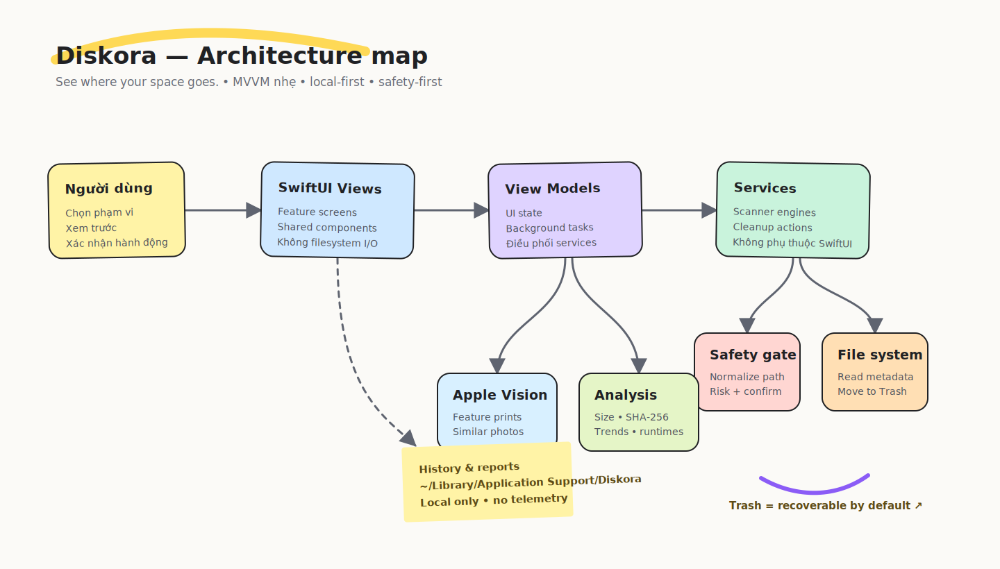
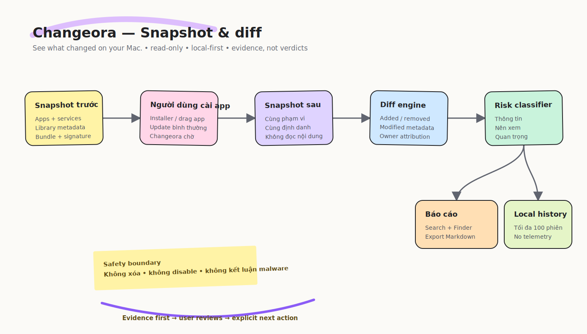
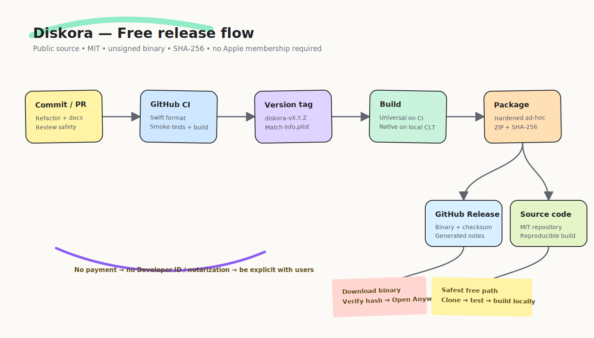

# Architecture / Kiến trúc / アーキテクチャ

[Tiếng Việt](#vi) · [English](#en) · [日本語](#ja)

<a id="vi"></a>

## Tiếng Việt

### Mục tiêu

Monorepo chứa các tiện ích nhỏ nhưng mỗi ứng dụng vẫn độc lập về mã nguồn, test, release và quyền truy cập. Phần dùng chung chỉ được trích xuất khi có ít nhất hai ứng dụng thực sự cần nó.

### Cấu trúc

```text
toolbox/
├── apps/
│   ├── diskora/
│   │   ├── Sources/Diskora/{App,Core,Features,Views}/
│   │   ├── Tests/
│   │   ├── Resources/
│   │   └── scripts/
│   └── changeora/
│       ├── Sources/Changeora/{App,Core,Features,Views}/
│       ├── Tests/
│       ├── Resources/
│       └── scripts/
├── docs/
├── .github/workflows/{ci.yml,release.yml}
└── LICENSE
```

### Diskora

Diskora dùng kiến trúc MVVM nhẹ:



- View không thực hiện filesystem I/O.
- ViewModel quản lý trạng thái và điều phối tác vụ nền.
- Service không phụ thuộc SwiftUI.
- Đường dẫn destructive phải được chuẩn hóa và kiểm tra phạm vi.
- Nhóm nguy hiểm không được chọn tự động.
- Mọi thao tác có thể phục hồi phải ưu tiên Trash.

### Changeora

Changeora dùng cùng nguyên tắc MVVM nhưng toàn bộ pipeline là read-only:



- `SystemSnapshotScanner` thu thập metadata trong một danh sách vị trí hữu hạn.
- `SnapshotDiffEngine` là hàm thuần và không truy cập filesystem.
- `ChangeoraViewModel` chạy scan ngoài main actor và chỉ cập nhật UI trên main actor.
- `SnapshotStore` ghi JSON nguyên tử vào Application Support.
- Lịch sử chỉ lưu các mục thay đổi; snapshot đầy đủ chỉ tồn tại trong phiên đang theo dõi.
- Risk classification là mức ưu tiên review, không phải đánh giá malware.
- Phiên bản 1.0.0 không có chức năng destructive hoặc network client.

### Release flow



Các sơ đồ sử dụng phong cách whiteboard với card pastel, connector cong và sticky note, nhưng được lưu trực tiếp trong Git để review và version-control.

---

<a id="en"></a>

## English

### Goal

The monorepo contains small utilities while keeping each application independent in source code, tests, releases, and permissions. Shared code is extracted only after at least two applications genuinely require it.

### Structure

```text
toolbox/
├── apps/
│   ├── diskora/
│   │   ├── Sources/Diskora/{App,Core,Features,Views}/
│   │   ├── Tests/
│   │   ├── Resources/
│   │   └── scripts/
│   └── changeora/
│       ├── Sources/Changeora/{App,Core,Features,Views}/
│       ├── Tests/
│       ├── Resources/
│       └── scripts/
├── docs/
├── .github/workflows/{ci.yml,release.yml}
└── LICENSE
```

### Diskora

Diskora uses a lightweight MVVM architecture:


- Views do not perform filesystem I/O.
- View models own state and coordinate background work.
- Services do not depend on SwiftUI.
- Destructive paths must be normalized and checked against allowed scopes.
- High-risk groups are never selected automatically.
- Recoverable operations should prefer Trash.

### Changeora

Changeora uses the same MVVM principles with an entirely read-only pipeline:


- `SystemSnapshotScanner` collects metadata from a finite list of locations.
- `SnapshotDiffEngine` is a pure function with no filesystem access.
- `ChangeoraViewModel` scans outside the main actor and updates UI only on the main actor.
- `SnapshotStore` writes JSON atomically to Application Support.
- History stores only changed items; a full snapshot exists only during an active watch session.
- Risk classification indicates review priority, not a malware verdict.
- Version 1.0.0 contains no destructive feature or network client.

### Release flow


The diagrams use a whiteboard style with pastel cards, curved connectors, and sticky notes, while remaining directly version-controlled and reviewable in Git.

---

<a id="ja"></a>

## 日本語

### 目的

このモノレポは小規模なユーティリティを格納しますが、各アプリケーションのソースコード、テスト、リリース、権限は独立させます。共有コードは、少なくとも 2 つのアプリケーションで実際に必要になった場合のみ抽出します。

### 構成

```text
toolbox/
├── apps/
│   ├── diskora/
│   │   ├── Sources/Diskora/{App,Core,Features,Views}/
│   │   ├── Tests/
│   │   ├── Resources/
│   │   └── scripts/
│   └── changeora/
│       ├── Sources/Changeora/{App,Core,Features,Views}/
│       ├── Tests/
│       ├── Resources/
│       └── scripts/
├── docs/
├── .github/workflows/{ci.yml,release.yml}
└── LICENSE
```

### Diskora

Diskora は軽量な MVVM アーキテクチャを使用します。


- View は filesystem I/O を実行しません。
- ViewModel は状態を管理し、バックグラウンド処理を調整します。
- Service は SwiftUI に依存しません。
- 破壊的操作のパスは正規化し、許可された範囲内か確認します。
- 高リスクのグループを自動選択しません。
- 復元可能な操作ではゴミ箱を優先します。

### Changeora

Changeora は同じ MVVM 原則を使用し、パイプライン全体を read-only にしています。


- `SystemSnapshotScanner` は有限のロケーション一覧から metadata を収集します。
- `SnapshotDiffEngine` は filesystem にアクセスしない純粋関数です。
- `ChangeoraViewModel` は main actor の外で scan を実行し、UI 更新のみ main actor で行います。
- `SnapshotStore` は JSON を Application Support へ atomic に書き込みます。
- 履歴には変更された項目だけを保存し、完全な snapshot は監視中のセッションにのみ存在します。
- Risk classification は確認優先度であり、マルウェア判定ではありません。
- version 1.0.0 には破壊的機能および network client がありません。

### リリースフロー


図は pastel card、曲線 connector、sticky note を使った whiteboard スタイルで、Git 上で直接レビューおよび version control できます。
