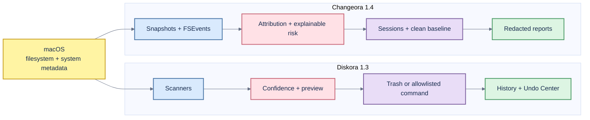

# Toolbox architecture

Toolbox is a monorepo for two independent, local-first macOS applications. Diskora changes files only after review; Changeora observes system changes and produces evidence.

Both presentation layers use the same localization pattern: an `AppLanguage` preference stored in `UserDefaults`, an environment locale that refreshes SwiftUI views, and packaged `en.lproj` resources. Vietnamese source copy is the development fallback. English is selected on first launch, and switching languages never changes scan data, history, or safety decisions.


```mermaid
%%{init: {"theme":"base","flowchart":{"curve":"basis","nodeSpacing":35,"rankSpacing":50},"themeVariables":{"background":"#F7F7F5","fontFamily":"Inter, Arial, sans-serif","lineColor":"#667085","primaryTextColor":"#172B4D"}}}%%
flowchart LR
    M["macOS<br/>filesystem + system metadata"]:::yellow
    subgraph D["Diskora 1.3"]
        DS["Scanners"]:::blue --> DC["Confidence + preview"]:::pink
        DC --> DA["Trash or allowlisted command"]:::purple
        DA --> DU["History + Undo Center"]:::green
    end
    subgraph C["Changeora 1.4"]
        CS["Snapshots + FSEvents"]:::blue --> CA["Attribution + explainable risk"]:::pink
        CA --> CB["Sessions + clean baseline"]:::purple
        CB --> CE["Redacted reports"]:::green
    end
    M --> DS
    M --> CS
    classDef yellow fill:#FFF4A3,stroke:#C9A227,stroke-width:2px,color:#172B4D
    classDef blue fill:#D9EAFD,stroke:#4C78A8,stroke-width:2px,color:#172B4D
    classDef pink fill:#FFE1E6,stroke:#C96A7B,stroke-width:2px,color:#172B4D
    classDef purple fill:#E9DDF7,stroke:#8064A2,stroke-width:2px,color:#172B4D
    classDef green fill:#DDF5E3,stroke:#4F9D69,stroke-width:2px,color:#172B4D
```

## English

### Repository boundaries

Each directory under `apps/` is an independent Swift package with its own executable, resources, tests, scripts, version, and release archive. Shared repository policy lives at the root; the applications do not import one another.

```text
toolbox/
├── apps/
│   ├── diskora/
│   │   ├── Sources/Diskora/{App,Core,Features,Views}
│   │   ├── Resources
│   │   ├── Tests/{Unit,Smoke}
│   │   └── scripts
│   └── changeora/
│       ├── Sources/Changeora/{App,Core,Features,Views}
│       ├── Resources
│       ├── Tests/{Unit,Smoke}
│       └── scripts
├── docs/
└── .github/workflows/
```

SwiftUI views own presentation and user intent. Feature view models coordinate asynchronous work. Services perform scanning, comparison, persistence, or narrowly scoped mutations. Core models are Codable and UI-independent where practical.

### Diskora 1.3

Diskora follows a review-before-action pipeline:

1. A scanner produces typed candidates and evidence.
2. Each candidate receives Safe, Review, or Dangerous confidence with a concrete reason.
3. The user selects exact targets and confirms the action.
4. Recoverable files move through the macOS Trash API.
5. History records both original and Trash URLs so Undo Center can restore without overwriting an existing path.

Duplicate detection first groups equal sizes, hashes the first and last 64 KiB, then computes full SHA-256 only for surviving groups. Work is sequential to bound disk pressure, and phase progress is published to the UI.

Similar Photos generates local Vision feature prints, compares candidate pairs, and uses connected-component clustering. Recommendation quality considers resolution, sharpness, size, and dates; no image leaves the Mac.

Application cleanup uses Bundle ID and typed evidence. Package receipts and background-item databases are evidence, not ordinary deletion targets. Developer Cleanup runs only fixed executable paths and allowlisted arguments. Scheduled Scan launches the app in scan-only mode, posts a local notification, and never calls a cleaner.

### Changeora 1.4

Changeora takes a recursive metadata snapshot before an installation, update, or uninstall. An FSEvents journal then captures paths changed during the observation window. Finishing a session takes another snapshot and combines:

- snapshot additions, modifications, and removals;
- event-only paths that changed below snapshot traversal limits;
- category-specific risk reasons;
- attribution signals such as Bundle ID, Team ID, signing metadata, application name, and modification time.

Session history is append-only application data. A user may designate a trusted clean baseline, compare the baseline with a session, or compare any two sessions. JSON and Markdown exports replace the current home prefix with `~`. Changeora is observational and does not uninstall or delete detected items.

### Persistence and concurrency

Both applications use Codable files under their own `~/Library/Application Support/<App>` directory. Stores write atomically. Long-running scanners use Swift concurrency and publish UI state on the main actor. FSEvents owns a dedicated dispatch queue and synchronizes its bounded event buffer.

### Safety invariants

- No automatic deletion.
- No destination overwrite during restore.
- No shell evaluation or user-composed command string.
- No name-only deletion of application leftovers.
- No network transport or telemetry.
- Permission failures become visible scan errors or reduced coverage.
- Read-only observations remain separate from mutation services.

### Verification strategy

Unit tests cover deterministic models, diffing, persistence, and restore behavior. Standalone smoke tests exercise core behavior in temporary directories without requiring the Swift testing runtime. CI runs formatting, unit tests, smoke tests, and release builds for both packages.

## Tiếng Việt

Hai presentation layer dùng cùng mô hình localization: lựa chọn `AppLanguage` lưu trong `UserDefaults`, environment locale làm mới SwiftUI view và tài nguyên `en.lproj` được đóng gói trong app. Nội dung nguồn tiếng Việt là development fallback. English được chọn ở lần chạy đầu; đổi ngôn ngữ không tác động dữ liệu quét, lịch sử hoặc quyết định an toàn.

### Ranh giới repository

Mỗi thư mục trong `apps/` là một Swift package độc lập, có executable, resource, test, script, version và archive release riêng. Chính sách dùng chung nằm ở root; hai ứng dụng không import lẫn nhau.

SwiftUI view quản lý phần trình bày và ý định người dùng. Feature view model điều phối công việc bất đồng bộ. Service thực hiện scan, so sánh, persistence hoặc mutation có phạm vi hẹp. Core model dùng Codable và tách khỏi UI khi phù hợp.

### Diskora 1.3

Diskora dùng quy trình xem trước trước khi hành động:

1. Scanner tạo candidate có type và evidence.
2. Candidate nhận mức An toàn, Cần xem lại hoặc Nguy hiểm kèm lý do cụ thể.
3. Người dùng chọn đúng target và xác nhận.
4. File có thể phục hồi được chuyển qua macOS Trash API.
5. History ghi cả URL gốc và URL trong Trash để Undo Center khôi phục mà không ghi đè đường dẫn tồn tại.

Duplicate Scanner gom nhóm theo kích thước, hash 64 KiB đầu/cuối, rồi chỉ tính SHA-256 đầy đủ cho nhóm còn trùng. Xử lý tuần tự để giới hạn áp lực ổ đĩa và publish tiến độ từng giai đoạn.

Similar Photos tạo Vision feature print local, so sánh từng cặp và dùng connected-component clustering. Gợi ý giữ ảnh dựa trên độ phân giải, độ nét, kích thước và ngày; ảnh không rời máy Mac.

Application Cleanup dùng Bundle ID và evidence có type. Package receipt và database background item chỉ là evidence, không phải target xóa thông thường. Developer Cleanup chỉ chạy executable path cố định với argument trong allowlist. Scheduled Scan khởi động app ở chế độ chỉ quét, gửi notification local và không gọi cleaner.

### Changeora 1.4

Changeora tạo snapshot metadata đệ quy trước khi cài đặt, cập nhật hoặc gỡ ứng dụng. FSEvents journal ghi path thay đổi trong thời gian quan sát. Khi kết thúc, snapshot thứ hai được kết hợp với:

- file thêm, sửa và xóa giữa hai snapshot;
- path chỉ có trong event ở sâu hơn giới hạn duyệt snapshot;
- lý do rủi ro theo category;
- tín hiệu quy nguồn như Bundle ID, Team ID, chữ ký, tên ứng dụng và thời gian sửa.

Session history là dữ liệu application append-only. Người dùng có thể đặt baseline máy sạch, so sánh baseline với session hoặc so sánh hai session bất kỳ. Export JSON/Markdown thay prefix home hiện tại bằng `~`. Changeora chỉ quan sát, không uninstall hoặc xóa item phát hiện được.

### Persistence và concurrency

Hai ứng dụng lưu file Codable trong `~/Library/Application Support/<App>` riêng và ghi atomic. Scanner dài dùng Swift concurrency, cập nhật UI trên main actor. FSEvents dùng dispatch queue riêng và đồng bộ event buffer có giới hạn.

### Bất biến an toàn

- Không tự động xóa.
- Không ghi đè destination khi restore.
- Không evaluate shell hoặc command string do người dùng ghép.
- Không xóa leftover chỉ dựa trên tên.
- Không telemetry hoặc truyền dữ liệu mạng.
- Lỗi permission được hiển thị thành scan error hoặc phạm vi bị giảm.
- Quan sát chỉ đọc tách khỏi mutation service.

### Chiến lược kiểm thử

Unit test bao phủ model xác định, diff, persistence và restore. Smoke test độc lập chạy core behavior trong thư mục tạm mà không cần Swift testing runtime. CI chạy format, unit test, smoke test và release build cho cả hai package.

## 日本語

両 presentation layer は同じ localization 構成を使います。`AppLanguage` を `UserDefaults` に保存し、environment locale で SwiftUI view を更新し、`en.lproj` resource を app に同梱します。ベトナム語 source copy が development fallback です。初回起動時は English で、言語変更は scan data、history、安全判定に影響しません。

### Repository boundary

`apps/` 配下の各 directory は独立した Swift package で、個別の executable、resource、test、script、version、release archive を持ちます。共通 policy は root に置き、アプリ同士は import しません。

SwiftUI view は表示と user intent、feature view model は非同期処理の調整、service は scan、compare、persistence、限定的 mutation を担当します。Core model は可能な限り Codable かつ UI 非依存です。

### Diskora 1.3

Diskora は action 前 review の pipeline を使います。

1. Scanner が type と evidence を持つ candidate を生成します。
2. Candidate に「安全・要確認・危険」と具体的な理由を付与します。
3. User が正確な target を選択し確認します。
4. 復元可能な file は macOS Trash API で移動します。
5. History が元 URL と Trash URL を記録し、Undo Center は既存 path を上書きせず復元します。

Duplicate detection は同じ size を grouping し、先頭と末尾 64 KiB を hash してから、残った group だけ full SHA-256 を計算します。Disk 負荷を制限するため逐次処理し、phase progress を UI に公開します。

Similar Photos は local Vision feature print、pairwise comparison、connected-component clustering を使います。推奨品質は解像度、鮮明度、size、date から評価し、画像を Mac 外へ送りません。

Application Cleanup は Bundle ID と typed evidence を使います。Package receipt と background-item database は evidence であり通常の削除対象ではありません。Developer Cleanup は固定 executable path と allowlist argument だけを実行します。Scheduled Scan は scan-only mode と local notification だけを使い cleaner を呼びません。

### Changeora 1.4

Changeora は install、update、uninstall 前に再帰的 metadata snapshot を取得し、観測中は FSEvents journal で変更 path を記録します。終了時の snapshot と次を統合します。

- Snapshot 間の追加、変更、削除
- Snapshot traversal limit より深い event-only path
- Category ごとの risk reason
- Bundle ID、Team ID、signing metadata、application name、更新時刻による attribution

Session history は append-only application data です。Trusted clean baseline、baseline と session、任意の 2 session を比較できます。JSON/Markdown export は現在の home prefix を `~` に置換します。Changeora は観測専用で、検出 item を uninstall または削除しません。

### Persistence と concurrency

両アプリは Codable file を個別の `~/Library/Application Support/<App>` に atomic write します。長時間 scanner は Swift concurrency を使い main actor で UI state を更新します。FSEvents は専用 dispatch queue と同期済み bounded event buffer を持ちます。

### Safety invariant

- 自動削除しません。
- Restore 時に destination を上書きしません。
- Shell evaluation や user-composed command string を使いません。
- 名前だけで application leftover を削除しません。
- Network transfer と telemetry を行いません。
- Permission failure は scan error または coverage 低下として表示します。
- Read-only observation と mutation service を分離します。

### Verification strategy

Unit test は deterministic model、diff、persistence、restore を対象にします。Standalone smoke test は Swift testing runtime なしで temporary directory 上の core behavior を検証します。CI は両 package の format、unit、smoke、release build を実行します。
