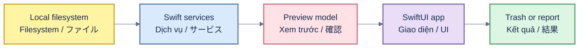

# Toolbox architecture / Kiến trúc / アーキテクチャ

```mermaid
%%{init: {"theme":"base","themeVariables":{"background":"#FFFFFF","fontFamily":"Arial, sans-serif","lineColor":"#667085","primaryTextColor":"#172B4D"}}}%%
flowchart LR
    F["Local filesystem<br/>Filesystem / ファイル"]:::yellow
    S["Swift services<br/>Dịch vụ / サービス"]:::blue
    P["Preview model<br/>Xem trước / 確認"]:::pink
    U["SwiftUI app<br/>Giao diện / UI"]:::purple
    T["Trash or report<br/>Kết quả / 結果"]:::green
    F --> S --> P --> U --> T
    classDef yellow fill:#FFF4A3,stroke:#C9A227,stroke-width:2px,color:#172B4D
    classDef blue fill:#D9EAFD,stroke:#4C78A8,stroke-width:2px,color:#172B4D
    classDef pink fill:#FFE1E6,stroke:#C96A7B,stroke-width:2px,color:#172B4D
    classDef purple fill:#E9DDF7,stroke:#8064A2,stroke-width:2px,color:#172B4D
    classDef green fill:#DDF5E3,stroke:#4F9D69,stroke-width:2px,color:#172B4D
```

- **English:** Each app in `apps/` is an independent Swift package. Core services are testable without UI and destructive paths require explicit user confirmation.
- **Tiếng Việt:** Mỗi app trong `apps/` là Swift package độc lập. Core service test được không cần UI và thao tác phá hủy phải có xác nhận.
- **日本語:** `apps/` の各アプリは独立した Swift package です。コアサービスは UI なしでテストでき、破壊的処理には明示的な確認が必要です。
