# Operations and release runbook

```mermaid
%%{init: {"theme":"base","flowchart":{"curve":"basis"},"themeVariables":{"background":"#F7F7F5","fontFamily":"Inter, Arial, sans-serif","lineColor":"#667085","primaryTextColor":"#172B4D"}}}%%
flowchart LR
    C["Choose product versions"]:::yellow --> V["Format + test + build"]:::blue
    V --> A["Create app archives"]:::pink
    A --> T["Commit + tag + CI"]:::purple
    T --> G["GitHub release + checksums"]:::green
    G --> Q["Download verification"]:::yellow
    classDef yellow fill:#FFF4A3,stroke:#C9A227,stroke-width:2px,color:#172B4D
    classDef blue fill:#D9EAFD,stroke:#4C78A8,stroke-width:2px,color:#172B4D
    classDef pink fill:#FFE1E6,stroke:#C96A7B,stroke-width:2px,color:#172B4D
    classDef purple fill:#E9DDF7,stroke:#8064A2,stroke-width:2px,color:#172B4D
    classDef green fill:#DDF5E3,stroke:#4F9D69,stroke-width:2px,color:#172B4D
```



## English

### Release model

Diskora and Changeora version independently. A Toolbox release tag represents the repository delivery and states both included product versions. For example, Toolbox `v1.3.0` contains Diskora `1.2.0` and Changeora `1.3.0`.

Release assets contain application archives and matching SHA-256 files only. Do not upload a separate source ZIP or TAR archive. GitHub automatically adds “Source code” links to tag-based releases; those platform-managed links cannot be removed.

### Prerequisites

- macOS 13 or newer for supported runtime behavior
- Apple Silicon for the current unsigned `arm64` archives
- Swift 6.2 toolchain
- GitHub CLI authenticated with permission to push and manage releases
- A clean understanding of any pre-existing working-tree changes

### Validation

Run in each application:

```bash
swift format lint --recursive --parallel Sources Tests Package.swift
swift test
./scripts/test_core.sh
swift build
swift build -c release
```

If the active command-line toolchain cannot run XCTest, document the limitation and require the GitHub Actions unit-test job to pass before release. Smoke tests and release builds must still pass locally.

Review version metadata:

```bash
/usr/libexec/PlistBuddy -c 'Print :CFBundleShortVersionString' Resources/Info.plist
/usr/libexec/PlistBuddy -c 'Print :CFBundleVersion' Resources/Info.plist
```

Confirm the changelog, README, privacy policy, security policy, architecture, and this runbook reflect the shipped behavior in English, Vietnamese, and Japanese.

### Packaging

```bash
cd apps/diskora
./scripts/build_release.sh

cd ../changeora
./scripts/build_release.sh
```

Inspect each archive before publishing:

```bash
file apps/diskora/dist/Diskora.app/Contents/MacOS/Diskora
codesign -dv --verbose=4 apps/diskora/dist/Diskora.app
(cd apps/diskora/release && shasum -a 256 -c Diskora-1.2.0-macos-arm64-unsigned.zip.sha256)

file apps/changeora/dist/Changeora.app/Contents/MacOS/Changeora
codesign -dv --verbose=4 apps/changeora/dist/Changeora.app
(cd apps/changeora/release && shasum -a 256 -c Changeora-1.3.0-macos-arm64-unsigned.zip.sha256)
```

The builds are unsigned unless an explicit signing and notarization process is introduced. Label them accurately; never imply notarization.

### Publish sequence

1. Inspect `git diff` and confirm only intended source, test, metadata, and documentation changes.
2. Commit and push the default branch.
3. Wait for all GitHub Actions checks on the exact commit.
4. Create an annotated tag and GitHub release with the Toolbox version.
5. Upload the two application archives and their two checksum files.
6. Download every asset from GitHub and verify its checksum.
7. Confirm the release title, product versions, installation notes, unsigned status, and changelog link.

A release is complete only after remote assets have been downloaded and verified.

### Rollback and incident handling

Do not replace an asset silently. If an artifact is wrong but the tag is correct, mark the release unavailable, describe the problem, and publish a new patch release. If a vulnerability is involved, use the private process in [SECURITY.md](../SECURITY.md). Preserve logs and checksums while removing personal paths and credentials.

### Scheduled Scan operations

Diskora creates `~/Library/LaunchAgents/com.thang.diskora.scheduled-scan.plist` only after user action. The job opens Diskora with `--scheduled-scan`, scans safe targets, posts a local notification, and exits. It does not delete. Disable the schedule through Diskora; if diagnosing manually, inspect the plist and `launchctl print gui/$(id -u)/com.thang.diskora.scheduled-scan`.

## Tiếng Việt

### Mô hình release

Diskora và Changeora có version độc lập. Tag Toolbox đại diện cho lần giao repository và ghi rõ version của hai sản phẩm. Ví dụ Toolbox `v1.3.0` gồm Diskora `1.2.0` và Changeora `1.3.0`.

Asset release chỉ gồm archive ứng dụng và file SHA-256 tương ứng. Không upload ZIP/TAR mã nguồn riêng. GitHub tự thêm liên kết “Source code” vào release có tag và không thể xóa các liên kết do nền tảng quản lý này.

### Điều kiện

- macOS 14 trở lên cho hành vi runtime được hỗ trợ
- Apple Silicon cho archive unsigned `arm64` hiện tại
- Swift 6.2
- GitHub CLI đã đăng nhập, có quyền push và quản lý release
- Hiểu rõ mọi thay đổi có sẵn trong working tree

### Xác minh

Chạy toàn bộ command trong mục Validation tiếng Anh cho từng ứng dụng. Nếu command-line toolchain không chạy được XCTest, ghi rõ giới hạn và bắt buộc unit-test job của GitHub Actions đạt trước khi release. Smoke test và release build vẫn phải đạt local.

Kiểm tra version trong Info.plist, sau đó xác nhận changelog, README, privacy, security, architecture và runbook phản ánh đúng sản phẩm ở cả ba ngôn ngữ.

### Đóng gói

Chạy `scripts/build_release.sh` của từng app. Kiểm tra architecture, trạng thái ký, nội dung archive và SHA-256 bằng các command trong phần English. Build hiện là unsigned nếu chưa có quy trình ký/notarize rõ ràng; phải ghi nhãn chính xác.

### Trình tự publish

1. Kiểm tra `git diff`, chỉ giữ source, test, metadata và tài liệu dự kiến.
2. Commit và push default branch.
3. Chờ toàn bộ GitHub Actions trên đúng commit.
4. Tạo annotated tag và GitHub release theo version Toolbox.
5. Upload hai archive ứng dụng và hai file checksum.
6. Tải lại mọi asset từ GitHub và xác minh checksum.
7. Kiểm tra title, product version, hướng dẫn cài, trạng thái unsigned và link changelog.

Release chỉ hoàn tất sau khi asset remote đã được tải về và xác minh.

### Rollback và incident

Không âm thầm thay asset. Nếu artifact sai nhưng tag đúng, đánh dấu release không dùng được, mô tả vấn đề và tạo patch release mới. Nếu liên quan lỗ hổng, dùng quy trình riêng tư trong [SECURITY.md](../SECURITY.md). Giữ log/checksum nhưng xóa đường dẫn cá nhân và credential.

### Vận hành Scheduled Scan

Diskora chỉ tạo `~/Library/LaunchAgents/com.thang.diskora.scheduled-scan.plist` sau thao tác người dùng. Job mở Diskora với `--scheduled-scan`, quét target an toàn, gửi notification local rồi thoát; không xóa. Tắt lịch trong Diskora. Khi chẩn đoán thủ công, kiểm tra plist và lệnh `launchctl print` trong phần English.

## 日本語

### Release model

Diskora と Changeora は独立して versioning します。Toolbox tag は repository delivery を表し、含まれる両 product version を明記します。例として Toolbox `v1.3.0` は Diskora `1.2.0` と Changeora `1.3.0` を含みます。

Release asset は application archive と対応する SHA-256 file だけです。別の source ZIP/TAR は upload しません。GitHub は tag-based release に “Source code” link を自動追加し、platform 管理のため削除できません。

### 前提条件

- Supported runtime behavior 用の macOS 14 以降
- 現在の unsigned `arm64` archive 用の Apple Silicon
- Swift 6.2 toolchain
- Push と release 管理権限で認証済みの GitHub CLI
- 既存 working-tree change の把握

### Validation

各アプリで English の Validation command をすべて実行します。Command-line toolchain で XCTest を実行できない場合は制約を記録し、release 前に GitHub Actions unit-test job の成功を必須にします。Local smoke test と release build は必ず成功させます。

Info.plist の version を確認し、changelog、README、privacy、security、architecture、runbook が 3 言語で出荷動作と一致することを確認します。

### Packaging

各アプリの `scripts/build_release.sh` を実行します。English セクションの command で architecture、signing state、archive 内容、SHA-256 を確認します。明示的 signing/notarization process がない限り build は unsigned です。正確に表示し、notarized と誤認させないでください。

### Publish sequence

1. `git diff` を確認し、意図した source、test、metadata、documentation だけにします。
2. Default branch を commit/push します。
3. 同じ commit の GitHub Actions がすべて成功するまで待ちます。
4. Toolbox version の annotated tag と GitHub release を作ります。
5. 2 つの application archive と 2 つの checksum file を upload します。
6. GitHub から全 asset を download して checksum を検証します。
7. Release title、product version、installation note、unsigned 表示、changelog link を確認します。

Remote asset の再 download と検証が終わるまで release は完了ではありません。

### Rollback と incident

Asset を黙って置き換えません。Artifact が誤っていて tag が正しい場合は release を利用不可として問題を説明し、新しい patch release を公開します。Vulnerability の場合は [SECURITY.md](../SECURITY.md) の private process を使います。個人 path と credential を除き、log と checksum を保存します。

### Scheduled Scan operation

Diskora は user 操作後にだけ `~/Library/LaunchAgents/com.thang.diskora.scheduled-scan.plist` を作成します。Job は `--scheduled-scan` で Diskora を開き、安全 target を scan して local notification 後に終了し、削除しません。Diskora から schedule を無効化できます。手動調査では plist と English セクションの `launchctl print` を確認します。
